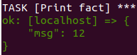
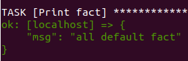
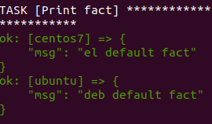
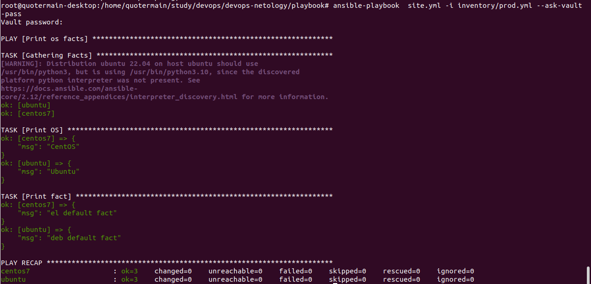
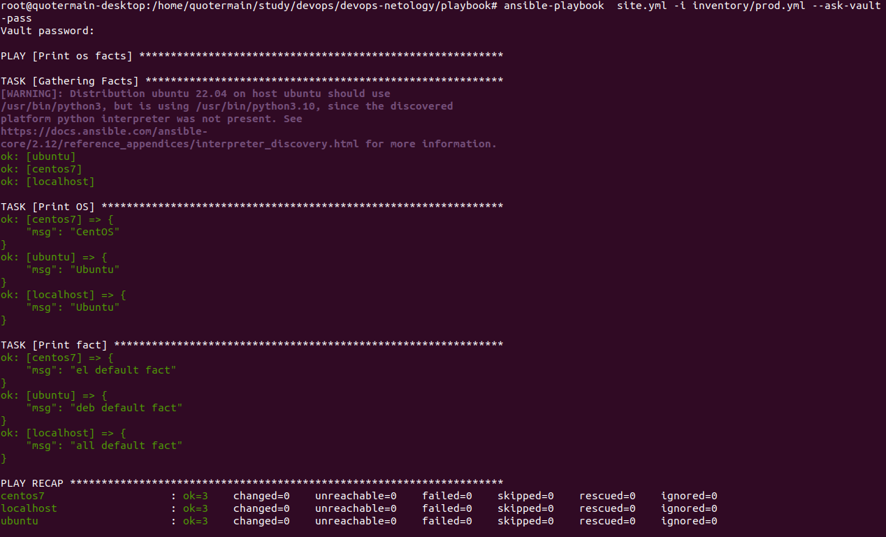

1. При запуске команды ```ansible-playbook site.yml -i inventory/test.yml``` вижу следующее:   
   

2. После изменения файла **group_vars/all/examp.yml** вижу следующее:   
   

3. Пользовался готовым окружением docker.   

4. После запуска вижу следующее:   
   

5. Внёс изменения в group_vars/deb/examp.yml и group_vars/el/examp.yml.

6. После изменений вижу следующее:   


7. Факты зашифровал.

8. После запуска вижу следующее:   


9. Думаю, подходящим плагином будет community.docker.docker_container.

10. После изменения файл выглядит [так](playbook/inventory/prod.yml).   

11. После запуска вижу следующее:   

