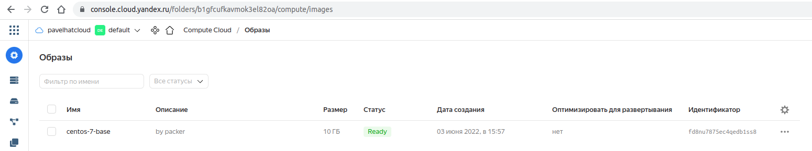
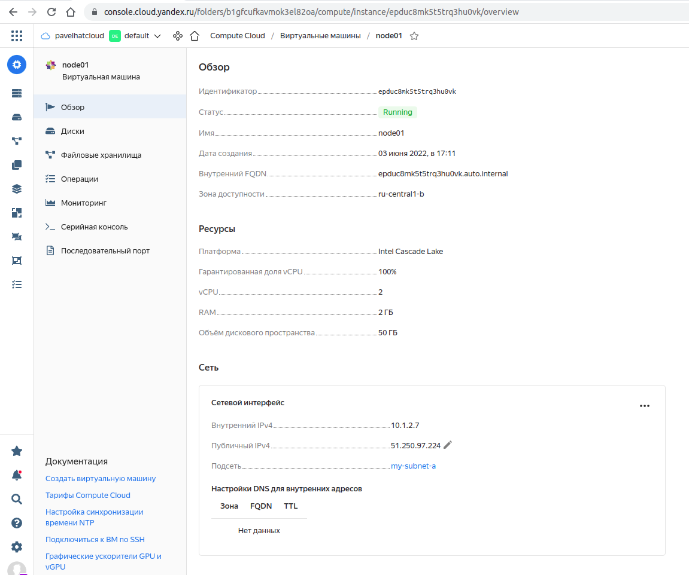
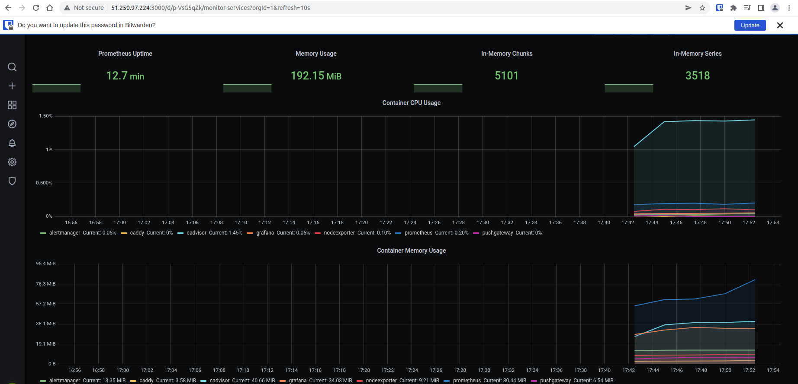

1. В описании ДЗ предлагается сделать скриншот аналогично слайду 37, но на данном слайде работа с ansible, поэтому прикладываю скриншоты по примеру слайдов 31 и 32:
   

2. Прилагаю скриншот с параметрами созданной ВМ:   
   

3. Прилагаю скриншот мониторинга:   

