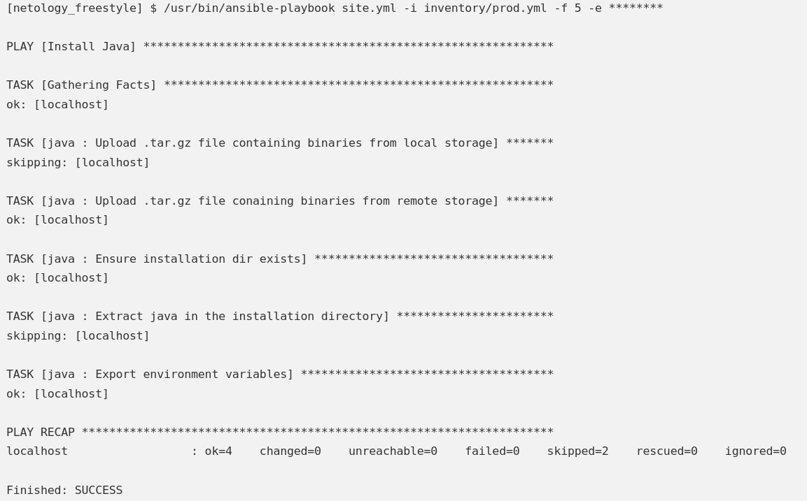
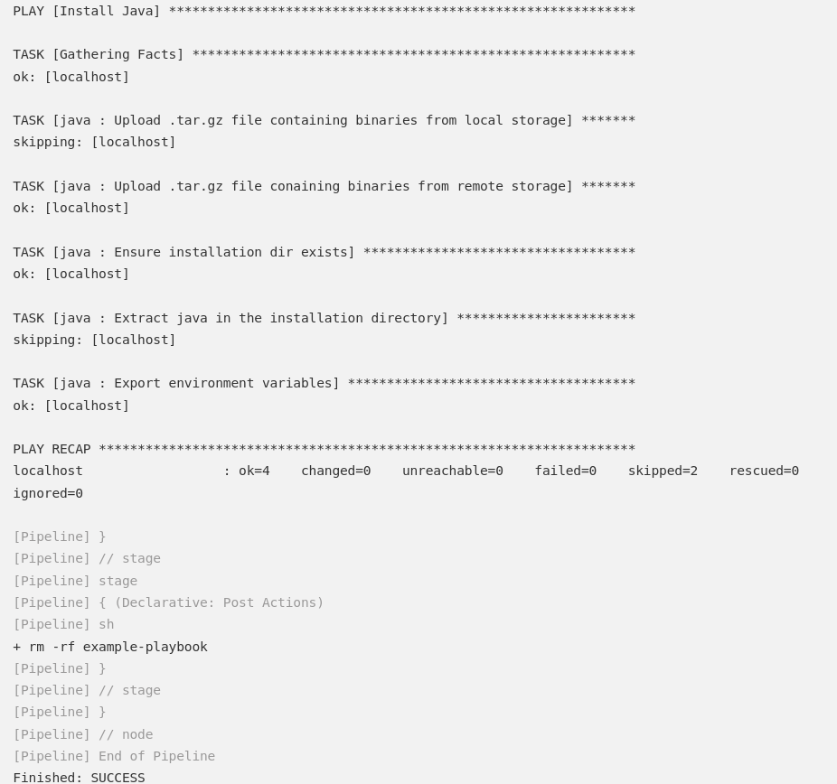
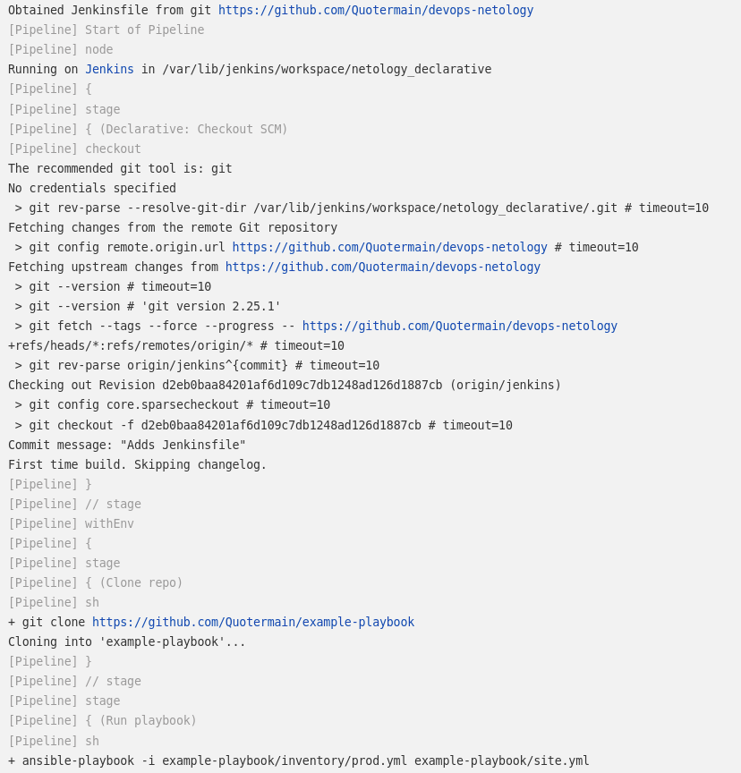
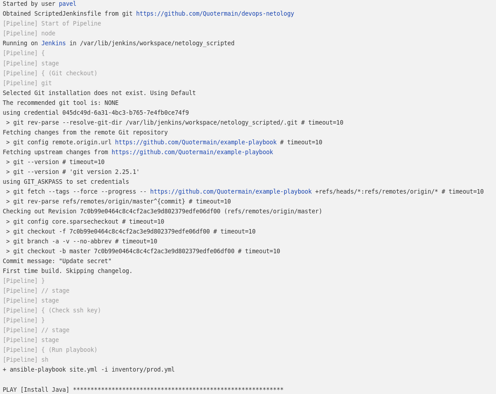

1. После запуска сформировнной freestyle джобы вижу следующее:   

2. Declarative Pipeline, сформированный через UI, выдаёт следующее:   

3. При использовании Jenkinsfile из репозитория результат тот же, что и предыдущий, только с изменениями начальных логов:   

4. Правильно ли я понял, что я должен изменить не только credentialsId, но и адрес репозитория на мой форк этого репозитория? Потому что без этого изменения со своими кредами я получаю ошибку доступа. Если понял правильно, то ScriptedJenkinsfile выглядит [так](ScriptedJenkinsfile). Начальные логи выглядят так:   

