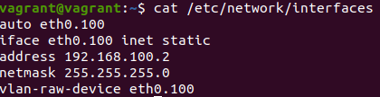
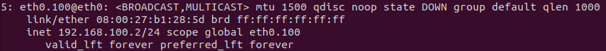
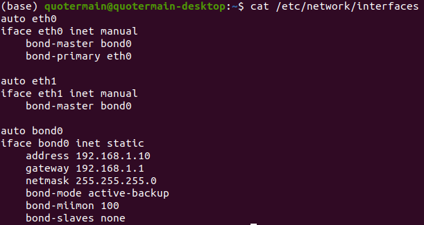

1. Увидеть сетевые интерфейсы в Linux можно с помощью команды ```ip link```:
. В Windows поможет команда ```ipconfig```:


2. Используется протокол ARP. Для применения соответствующего функционала можно использовать пакет Net-tools и команды ```arp``` или ```ip neigh```.

3. Речь о технологии VLAN (Virtual Local Area Network). В Linux для данной задачи можно использовать пакет Net-tools и семейство команд ip. Для создания конфига пришлось создать следующий файл:
.
После команды ```sudo ifconfig eth0.100 up``` вижу следующее:


4. Есть 7 типов агрегации интерфейсов: Balance Round Robin, Active backup, Balance XOR, Broadcast, 802.3ad, Balance TLB, Balance ALB. Для балансировки нагрузки используются две основные технологии: Keepalived и HAProxy.
Пример конфига:


5. В сети с маской /29 6 IP адресов, которые можно использовать. Из сети с маской /24 можно получить 32 подсети с маской /29. Примеры: 10.10.10.8, 10.10.10.16, 10.10.10.24.

6.  Частные IP адреса допустимо взять, например, из подсети 100.64.0.64.

7. Для просмотра ARP таблицы можно использоать команду```arp -a```. Для очистки ARP кеша используется  ```ip neigh flush all```. Для удаления из кеша одного адреса: ```arp -d <host>```. 
