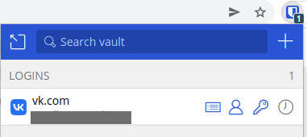
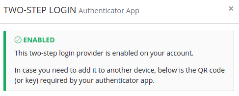
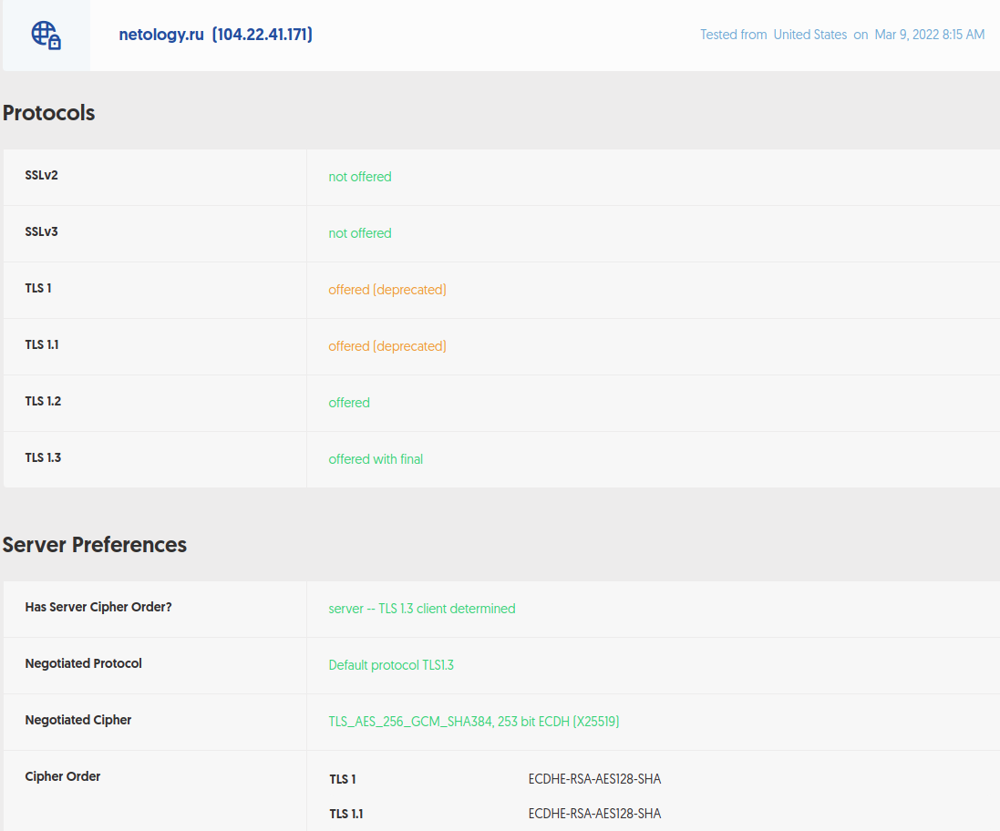

1. Установил Bitwarden, зарегистрировался, сохранил пароль:

2. Настроил вход в Bitwarden через Google authenticator OTP:
.

3. Использую localhost:443 для отображения стандартной странички Apache2 Ubuntu. Вижу примерно следующее:

4. Просканировал с помощью сервиса https://gf.dev/ сайт https://netology.ru/. Вижу примерно следующее:

