1. -

2. Учитывая тот факт, что в Linux уникальным идентификатором файла является не его имя, а inode, файлы, являющиеся жесткой ссылкой на один объект, не могут иметь разные права доступа и владельца, т.к. у них один inode на всех.

3. -

4. Разбил:
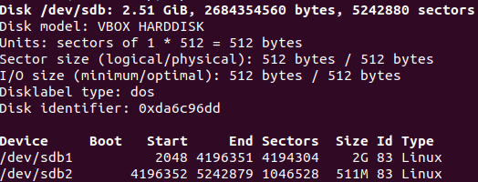

5. Использовал команду ```sfdisk -d /dev/sdb | sfdisk /dev/sdc```. Получил:
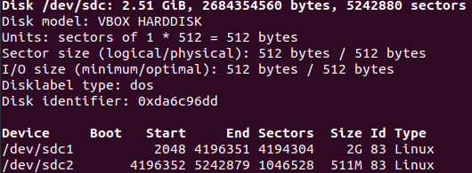

6. -

7. Собрал:
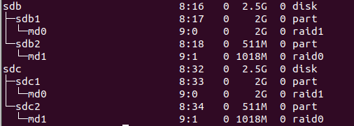

8. -

9. Создал:
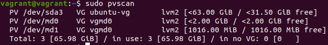

10. Создал:
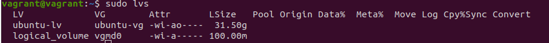

11. Создал:
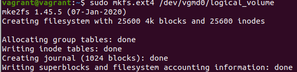

12. Смонтировал:
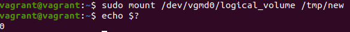

13. Файл поместил:
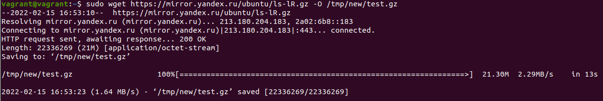

14. Вывод ```lsblk```:
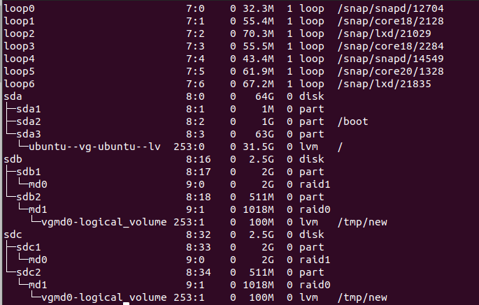

15. Целостность файла проверил:
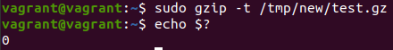

16. Переместил:
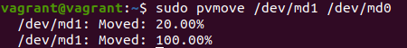

17. Сделал:
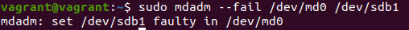

18. Вывод ```dmesg```:
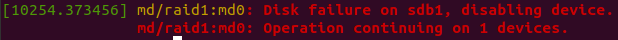

19. Протестировал:
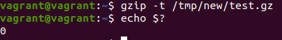
