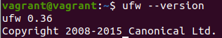
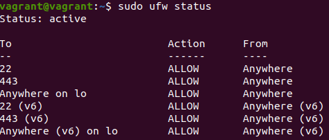
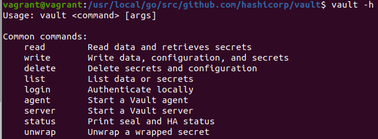
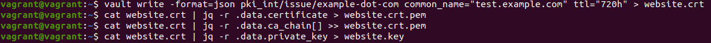
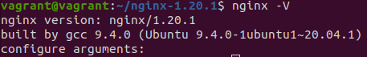
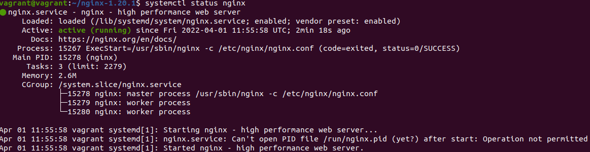
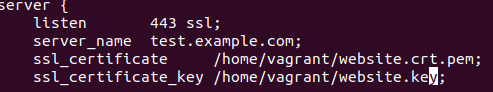
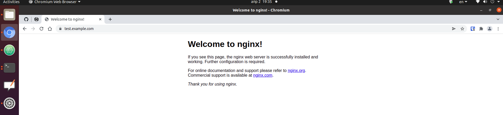
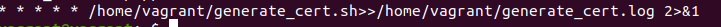
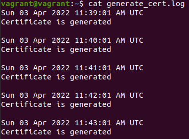

1. Выполнял задания на виртуальной машине vagrant.

2. ufw был предустановлен:  
  
Задание выполнил с помощью команд: ```sudo ufw allow 22```, ```sudo ufw allow 443```, ```sudo ufw allow in on lo```, ```sudo ufw enable```. Результат:  


3. Устанавливал из исходников по этой инструкции: https://www.vaultproject.io/docs/install#compiling-from-source. Результат:


4. Центр сертификации устанавливал по инструкции. Выпуск сертификата с последующим разбиением на файл сертификата и файл ключа осуществил следующим образом:


5. На хостовой машине установил корневой сертификат через найстройки Chromium:
. Также добавил в файл **/etc/hosts** следующую строку **192.168.0.103 test.example.com**.

6. Установил nginx из исходников по этой инструкции: https://www.nginx.com/resources/wiki/start/topics/tutorials/install/#building-nginx-from-source. Результат:

.

7. Фрагмент файла **/etc/nginx/conf.d/default.conf**:
.

8. Результат обращения к странице:


9. Скрипт выглядит следующим образом:
```shellscript
#!/bin/bash
date
vault write -format=json pki_int/issue/example-dot-com common_name="test.example.com" ttl="720">website.crt
cat website.crt | jq -r .data.certificate>website.crt.pem
cat website.crt | jq -r .data.ca_chain[]>>website.crt.pem
cat website.crt | jq -r .data.private_key>website.key
sudo systemctl restart nginx && echo "Certificate is generated"
echo
```
10. В целях демонтрации расписание crontab следующее:
. Пример вывода файла **generate_cert.log**:
.
Для выполнения cron job каждый месяц расписание должно быть примерно таким: **10 12 15 * * /home/vagrant/generate_cert.sh>>/home/vagrant/generate_cert.log 2>&1** (15го числа каждого месяца в 12:10).
