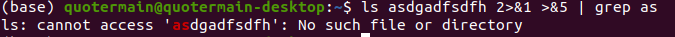
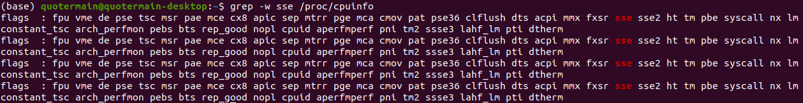
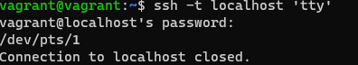
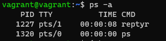

1. Согласно выводу команды ```type cd```, команда ```cd``` относится к типу *builtin*. Предположу, что по аналогии с командой ```echo```, команда ```cd``` могла бы быть реализована в виде бинарного файла. Однако встроенная версия предполагает максимальную эффективность выполнения.

2. Альтернативой будет команда ```grep -c <some_string> <some_file>```.

3. Речь о процессе ***systemd***:


4. Предположим, что PID сессии терминала, куда нам необходимо перенаправить поток ошибок команды ```ls```, **392557**. Тогда мы можем использовать следующую команду:```ls asdgsdhfgh 2> /proc/392557/fd/1```, где **asdgsdhfgh** - например, несуществующая директория. На адресуемой вкладке получаем:


5. Работающий пример: ```grep 'print' < projects/backtesting/main.py > test```. Т.е. на поток стандартного ввода команды ```grep``` подаётся содержимое файла исходного кода на языке Python с целью поиска строк, содержащих **print**. Результат выполнения команды перенаправляется в файл test.

6. Если ввести пароль при подключении к сессии эмулятора TTY, то можно перенаправить вывод из графического режима посредством, например, следующей команды: ```echo Hello>/dev/tty3```. Вывод отобразится в окне соответствующего эмулятора TTY.

7. Указанная команда устанавливает условный номер "5" в качестве файлового дескриптора для стандартного вывода текущего процесса оболочки, поэтому команда ```echo netology>/proc/$$/fd/5``` выведет текст "netology" в окне эмулятора терминала (т.е. стандартный вывод перенаправляется в стандартный вывод).

8. Пример использования stderr для pipe без потери отображения stdout на pty приводится на скриншоте:


9. Указанная команда выведет переменные окружения текущего процесса оболочки и их значения. Аналогичного вывода можно добиться командами env и printenv.

10. Файл */proc/<PID>/cmdline* содержит текст команды, запустившей соответствующий процесс. Файл */proc/<PID>/exe* - это символическая ссылка на файл, с помощью которого был запущен соответствующий процесс.

11. Как я понял из вывода команды ```grep -w sse /proc/cpuinfo```, процессор поддерживает самую первую версию SSE:
.

12. В соответствии с документацией команды ```ssh```, если в качестве возможной опции указана команда, которую необходимо выполнить на удалённом сервере (например, ```ssh localhost 'tty'```), псевдотерминал на целевом сервере не выделяется, что можно исправить путём добавления флага -t:
.

13. Попробовал перенести процесс top в screen в виртуальной машине. Получилось только после выполнения ```# echo 0 > /proc/sys/kernel/yama/ptrace_scope```:
.

14. Указанная команда позволит перенаправить стандартный вывод команды echo на стандартный ввод команды tee, которая, будучи запущена с привилегиями суперпользователя, выведет данные из своего стандартного ввода в окно терминала, а также в указанный файл, для доступа к которому как раз и нужны специальные права суперпользователя.
