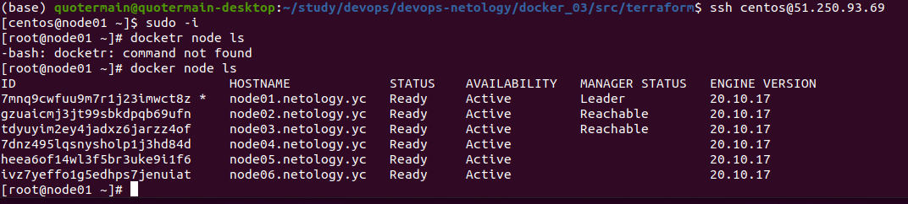
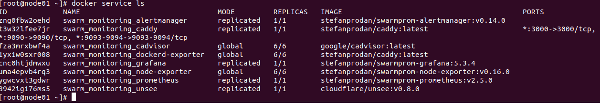

1. Основное отличие режима replication от режима global в том, что в первом случае задаётся количество реплик определенного сервиса, выполняющих одинаковые задачи, в то время как в global режиме указывается задача, которая должна выполняться на каждой ноде (при этом по умолчанию на каждой ноде одна реплика).   
Выбор лидера осуществляется с помощью алгоритма Raft. Когда ноды-Последователи перестают получать контрольные запросы от Лидера, они по истечении election timeout'а становятся Кандидатами, голосуют за собственное лидерство и посылают запросы голосов другим Последователям. Кандидат, набравший большее количество голосов, становится Лидером.   
Как я понял, overlay network - это подобие виртуальной сети, с помощью которой возможен обмен пакетами между docker контейнерами без настройки маршрутизации пользователем (работу по маршрутизации берёт на себя docker engine).   
2. Прилагаю скриншот с выводом команды ```docker node ls```:   

3. Прилагаю скриншот с выводом команды ```docker service ls```:   

