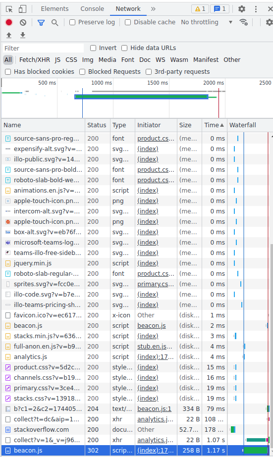
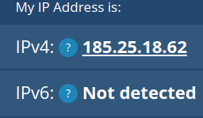
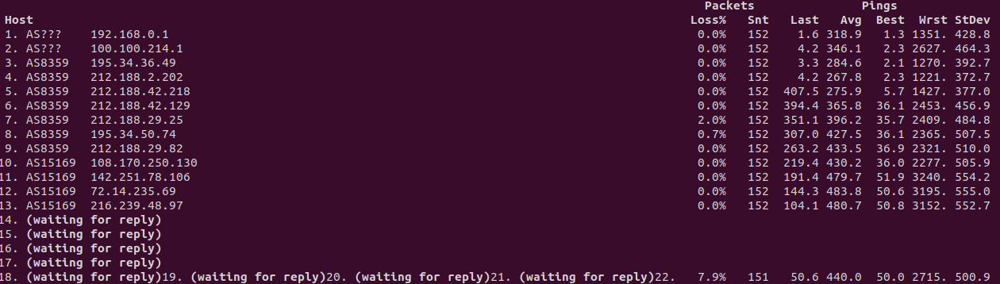
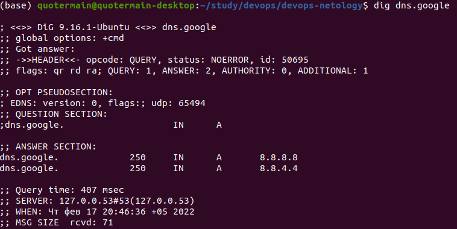
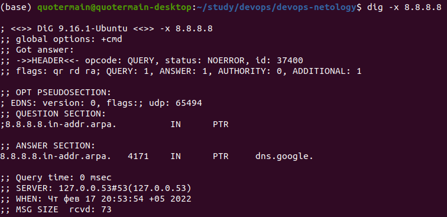
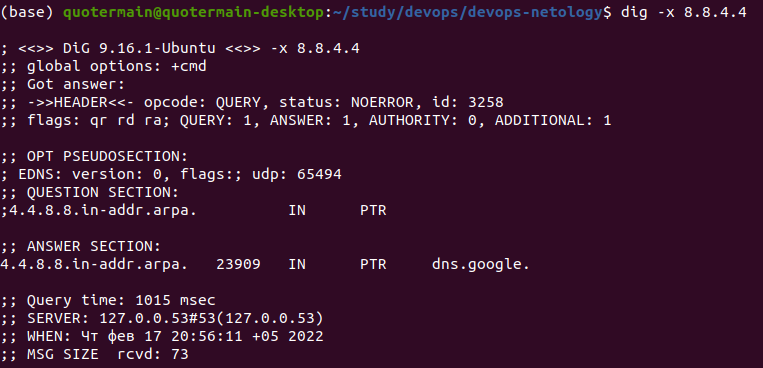

1. В ответе возвращается код **301**, свидетельствующий о перемещении запрашиваемого ресурса. Новый адрес указан в поле **location**.

2. Полученный http код: **200**. Я так понимаю, дольше всего обрабатывался запрос сценарию **beacon.js**.

3. В соответствии с сайтом **https://whatismyipaddress.com/** мой ip адрес:
.

4. Провайдер: OJSC Mobile TeleSystems. Автономная система: AS43148 MTS PJSC.

5. Сети, через которые проходит пакет: p2p-net-195-34-36, p2p-net-188-2, p2p-net-188-42, p2p-net-188-29, RU-MTU-960801, GOOGLE. AS, через которые проходит пакет: MTS(AS8359), GOOGLE(AS15169).

6. Как я понял из скриншота, худший результат на 12м хосте, т.к. среднее значение пинга наибольшее:

7. Адреса DNS серверов: 8.8.8.8, 8.8.4.4.

8. Доменное имя: dns.google

