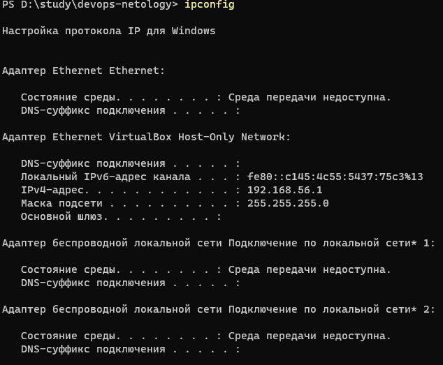

1. Увидеть сетевые интерфейсы в Linux можно с помощью команды ```ip link```:
. В Windows поможет команда ```ipconfig```:


2. Используется протокол ARP. Для применения соответствующего функционала можно использовать пакет Net-tools и команды ```arp``` или ```ip neigh```.

3. Речеь о технологии VLAN (Virtual Local Area Network). 
