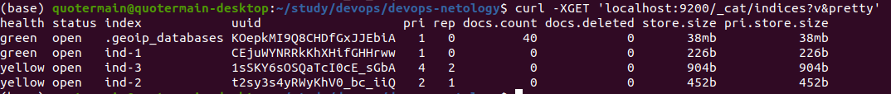
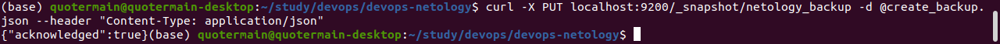
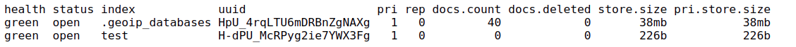
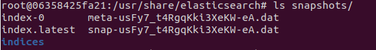
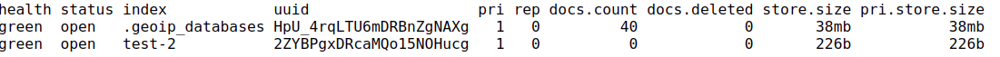
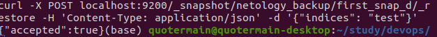
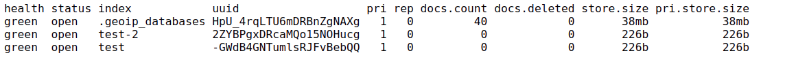

1. Docker-файл выглядит [так](Dockerfile). Образ находится по [ссылке](https://hub.docker.com/repository/docker/quotermain/elastic-netology). Ответ elasticsearch на запрос пути / в json виде выглядит [так](output.json).   

2. Состояние кластера:   
   
Состояние yellow обусловлено тем, что количество реплик у некоторых индексов превышает количество узлов в кластере, что препятствует распределению реплик по кластеру для обеспечения отказоустойчивости.   

3. Запрос для регистрации директории как snapshot repository и ответ на него выглядят так:   
. Файл json для запроса выглядит [так](create_backup.json).   
Список индексов после создания индекса test:   
   
Список файлов в директории со snapshotами:   
   
Список индексов после удаления test и создания test-2:   
.   
Запрос для восстановления индекса:   
   
Итоговое состояние кластера:   

