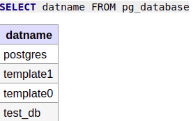
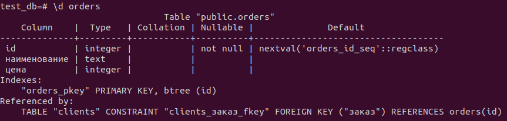
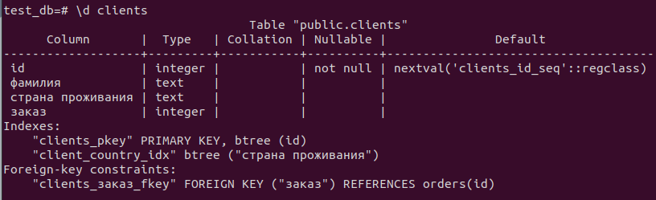
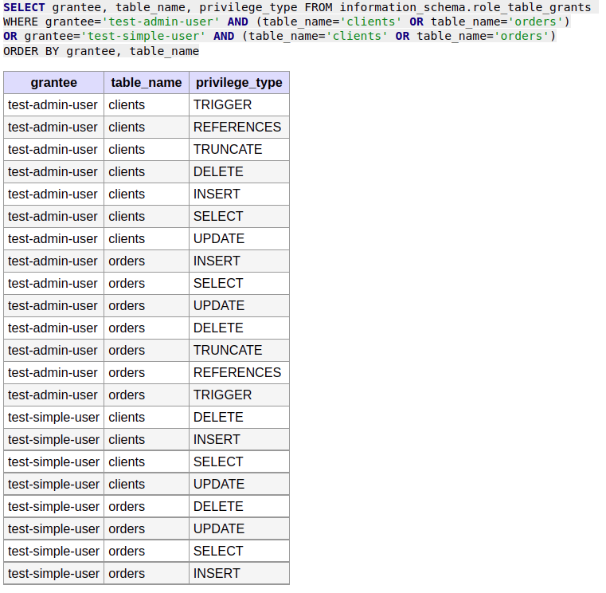
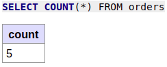
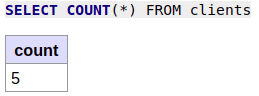
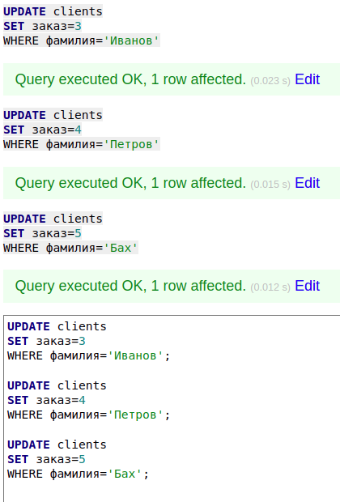
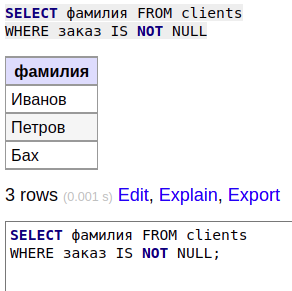
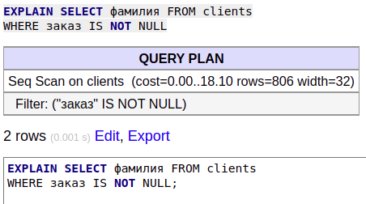

1. Прилагаю ссылку на [docker-compose манифест](docker-compose.yml).

2. Список БД:   
   
Описание таблицы orders:   
   
Описание таблицы clients:
   
SQL-запрос для выдачи списка пользователей с правами над таблицами test_db с результатом этого запроса:   


3. Приведу по одному запросу для наполнения таблицы с целью экономии пространства.   
Для orders:   
```sql
INSERT INTO orders(наименование, цена) VALUES('Шоколад', 10);
```
   
Для clients:   
```sql
INSERT INTO clients(фамилия, "страна проживания") VALUES('Иванов', 'USA');
```   
   

4. Запросы с результатами:   
   
Запрос измененных клиентов:   


5. Информация по выполнению запроса:   
   
Данная информация используется для оценки скорости выполнения запроса и включает его план. Seq scan свидетельствует о том, что в запросе применяется последовательный поиск вместо индексного. В скобках приводится "стоимость" запроса (в единицах измерения, выбираемых пользователем из вариантов, предлагаемых Postgres), оценочное число возвращаемых строк и их ширина. Также указывается условие фильтрации.   

6. Для создания бэкапа использовал команду:   
```
pg_dump -U test-admin-user test_db > backup_volume/test_db.sql
```   
Восстанавливался из бэкапа с помощью команды:   
```
psql -U test-admin-user test_db < backup_volume/test_db.sql
```
