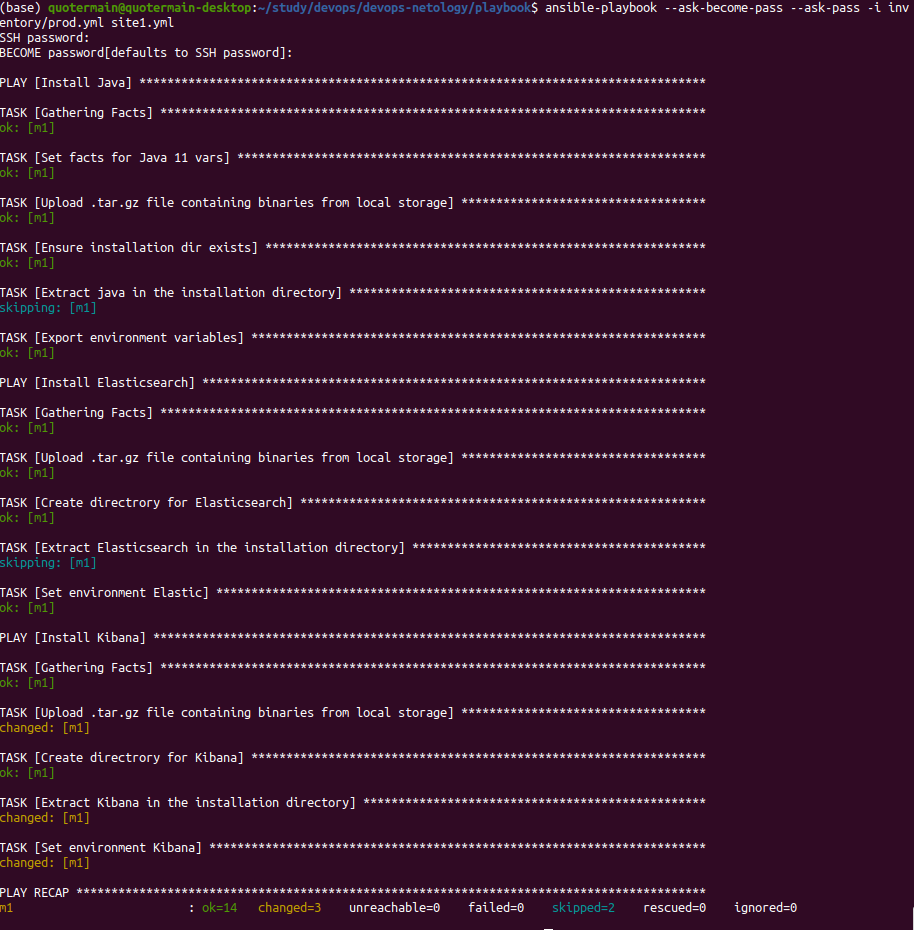

Пришлось изменить **site.yml**, т.к. при попытке скачивания артефактов **elasticsearch** и **kibana** (в том числе через VPN) получал ошибку 403: все архивы с артефактами закачиваются с контролирующего узла на целевой узел без обращения к artifacts.elastic.co. Файл выглядит [так](playbook/site.yml).

Play установки **Java** делает следующее:   
- определяет переменную *java_home* и помещает в неё путь на целевом узле для установки **Java**;
- загружает архив с артефактом **Java** на целевой узел;
- создаёт директорию для установки **Java**;
- распаковывает архив с **Java** в соответствующую домашнюю директорию;
- на целевом узле создаёт переменную окружения с домашней директорией **Java** и добавляет путь к папке */bin* в этой директории в переменную окружения *PATH*.

Аналогичным образом (за исключением таска создания переменной с путём инсталляции на целевом узле, т.к. этот путь берётся из [файла](playbook/group_vars/elasticsearch/vars.yml)) устанавливаются **elasticsearch** и **kibana**.

Итого получилось 3 плея: по одному для установки **Java**, **elasticsearch** и **kibana**. В каждом плее каждому таску присваиватся соответствующий тег (*java*, *elasticsearch* или *kibana*).

Запуск плейбука приводит примерно к следующему:   

