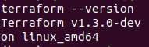
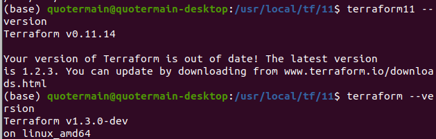

**Задача 1**   
1. С учётом того, что разработчики привыкли работать с Docker'ом и Terraform'ом, предлагается сделать упор на неизменяемую инфраструктуру.   
2. С целью избежания проблемы единой точки отказа хотелось бы отказаться от идеи центрального сервера для управления инфраструктурой.
3. С учётом представленных инструментов, можно начать с agent-less подхода. Если понадобится более глубокий мониторинг узлов, можно посмотреть в сторону agent-based решений.
4. Думаю, можно обойтись без отдельных средств управления конфигурацией или инициализации ресурсов, т.к. есть стэк Docker-Kubernetes.

**Задача 2**  

**Задача 3**   

