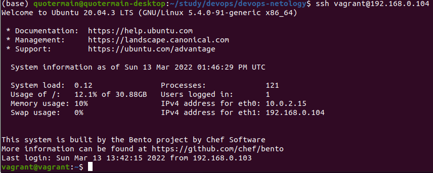
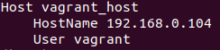
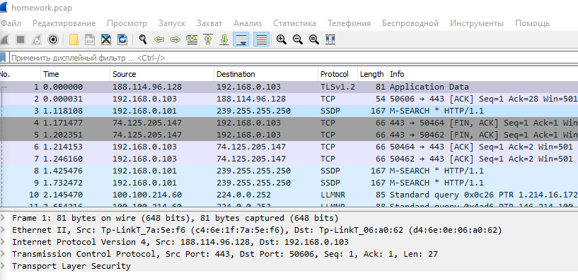

1. Установил Bitwarden, зарегистрировался, сохранил пароль:


2. Настроил вход в Bitwarden через Google authenticator OTP:
.

3. Использую localhost:443 для отображения стандартной странички Apache2 Ubuntu. Вижу примерно следующее:


4. Просканировал с помощью сервиса https://gf.dev/ сайт https://netology.ru/. Вижу примерно следующее:


5. Для генерации пары приватного и публичного ключей использовал команду ```ssh-keygen -t rsa -b 4096```. Для копирования публичного ключа на удаленный сервер использовал команду ```ssh-copy-id vagrant@192.168.0.104```. Далее подключался без запроса пароля для удаленного сервера:


6. Для доступа к серверу через его имя создал файл ~/.ssh/config следующего содержания:
. Доступ осуществлял командой ```ssh vagrant_host```.

7. Сформировал дамп командой ```sudo tcpdump -w homework.pcap -c100```. После открытия данного файла в Wireshark вижу примерно следующее:

