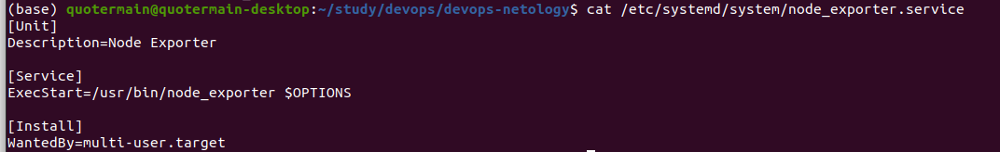
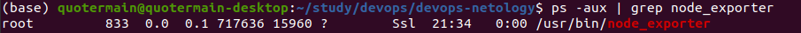
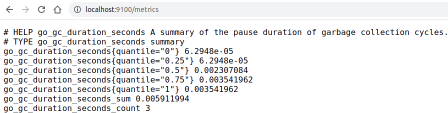
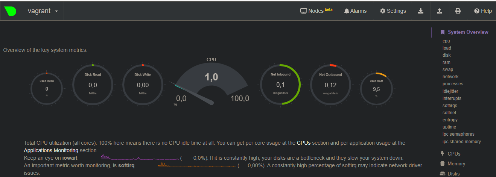
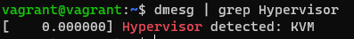
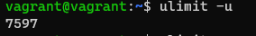

1. Создал такой unit-файл:
.
Кажется, работает:

При обращении вижу примерно следующее:


2. Для базового мониторинга предлагаю следующие опции (пишу без ```--collector.``` для экономии): cpu, cpufreq, diskstats, filesystem, infiniband, ipvs, loadavg, meminfo, netclass, netdev, netstat.

3. Сделал всё по инструкции. Вижу это:


4. Можно распознать факт загрузки ОС на системе виртуализации с помощью следующей команды: ```dmesg | grep "Hypervisor"```. Видим:


7. Это пример форк-бомбы. Мы определяем функцию под названием ```:```. В теле функции мы вызываем её же и ей же перенаправляем вывод через пайп, помещая запускаемые процессы в бэкграунд (```{ :|:& }```). ```;``` - завершение определения функции, ```:``` в конце - вызов данной функции. Предотвращение форк-бомб осуществляется через механизм ограничения количества процессов, которыми может владеть пользователь, посредством команды ```ulimit``` (только для текущей сессии), либо через редактирование файла /etc/security/limits.conf. По умолчанию, максимальное количество процессов:

