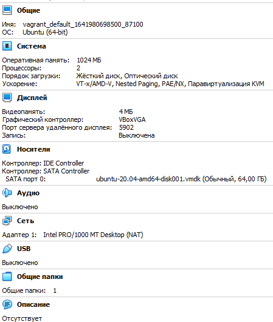
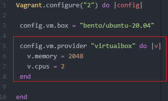
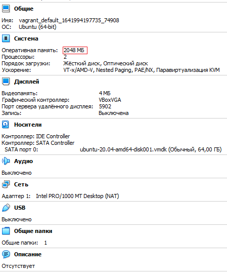
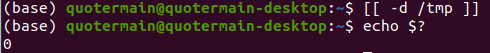
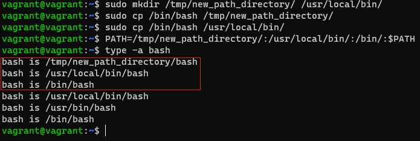

# Ответы к домашнему заданию "3.1. Работа в терминале, лекция 1"


##### 5. Ознакомьтесь с графическим интерфейсом VirtualBox, посмотрите как выглядит виртуальная машина, которую создал для вас Vagrant, какие аппаратные ресурсы ей выделены. Какие ресурсы выделены по-умолчанию?
##### Ответ.
Виртуальная машина, которую создал Vagrant, имеет следующие ресурсы:



##### 6. Ознакомьтесь с возможностями конфигурации VirtualBox через Vagrantfile: документация. Как добавить оперативной памяти или ресурсов процессора виртуальной машине?
##### Ответ.
Стандартные ресурсы, выделяемые Vagrant'ом, могут быть изменены посредством внесения корректировок в Vagrantfile. Например, на скриншоте ниже изменено значение выделяемой оперативной памяти:



Соответствующие изменения отражены в графическом интерфейсе VirtualBox:


##### 8. Ознакомиться с разделами man bash, почитать о настройках самого bash:
##### - какой переменной можно задать длину журнала history, и на какой строчке manual это описывается?
##### - что делает директива ignoreboth в bash?
##### Ответ.
Длину журнала history можно задать переменной HISTFILESIZE (627-я строчка manual'а).

Если ignoreboth включен в список переменной HISTCONTROL, в журнале history не будут сохраняться команды с "пробелом" в начале, а также команды, дублирующие непосредственных предшественников.

##### 9. В каких сценариях использования применимы скобки {} и на какой строчке man bash это описано?
##### Ответ.
Фигурные скобки применимы для запуска "составной команды", которая будет исполнена в среде текущей оболочки (382-я строчка man'а). Это может быть полезно при необходимости, например, перенаправить вывод такой команды в файл:
```
{ echo "I found all these PNGs:"; find . -iname "*.png"; echo "Within this bunch of files:"; ls; } > PNGs.txt
```
Фигурные скобки могу быть также использованы для задания диапазона. Например, команда ```echo {1..10}``` выведет строку из чисел от 1 до 10 через пробел.
Если обобщить, то фигурные скобки используются как инструмент "раскрытия" того, что заключено в них: составной команды, переменной, диапазона и т.д.

##### 10. С учётом ответа на предыдущий вопрос, как создать однократным вызовом touch 100000 файлов? Получится ли аналогичным образом создать 300000? Если нет, то почему?
##### Ответ.
Если без Гугла, навскидку и "в лоб", то:
```
for i in {1..100000}; do touch file_$i; done
```
Но это очень долго, поэтому с Гуглом: ```touch {1..100000}```
Однако с помощью данного варианта не удастся выполнить touch {1..300000} из-за превышения лимита, установленного переменной MAX_ARG_STRLEN. Дело в том, что bash "раскрывает" аргументы указанной команды в единую строку, длина которой не может превышать MAX_ARG_STRLEN. Но вариант с bash скриптом будет работать, хоть и долго.

##### 11. В man bash поищите по /\[\[. Что делает конструкция [[ -d /tmp ]]
##### Ответ.
Данная конструкция возвращает статус "0" (статус успешного завершения команды), т.к. условное выражение в квадратных скобках, проверяющее, является ли /tmp директорией, истинно.


##### 12. Скриншот вывода терминала виртуальной машины:


##### 13. Чем отличается планирование команд с помощью batch и at?
##### Ответ.
Основное отличие этих команд в том, что at позволяет задать время выполнения команды, в то время как batch выполняет команды из очереди команд только по достижении определенного показателя средней загрузки системы.
