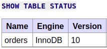
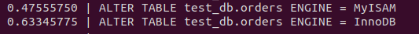
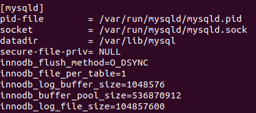

1. Версия сервера БД:   
   
 Количество записей с price > 300:   
 

2. Создавал пользователя так:   
   
Выдавал привилегии так:   
   
Получил:   
   

3. В test_db используется engine InnoDB.   
   
Запросы на изменение engine со временем их выполнения:   
   

4. Измененный my.cnf:   

