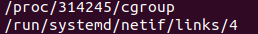

1. В ходе выполнения команды ```cd``` совершаются 2 системных вызова: ```stat()``` и ```chdir()```.

2. База данных имеет следующий путь: /etc/magic


3. С учётом того, что задача стоит именно в обнулении открытого удалённого файла именно за счёт перенаправления потоков, то самая простая команда: ```> /proc/<PID>/fd/<fd>```.

4. Зомби-процессы практическим не занимают каких-либо ресурсов ОС, за исключением объёма памяти, необходимого для записи о зомби-процессе в таблице процессов. Если в качестве ресурса рассматривать ограниченный пул идентификаторов процессов, то зомби-процесс также его занимает.

5. Если я правильно понял, ответ на этот вопрос предоставляет команда ```sudo opensnoop-bpfcc -d 1```, с помощью которой можно увидеть следующие файлы:
. На второй файл приходится около 20 вызовов.

6. Указанная команда совершает системный вызов uname(). Версию ядра и релиз ОС можно узнать из файлов /proc/sys/kernel/version и /proc/sys/kernel/osrelease соответственно. Цитата из man'a: **"Part of the utsname information is also accessible via /proc/sys/kernel/{ostype, hostname, osrelease, version, domainname}"**.
