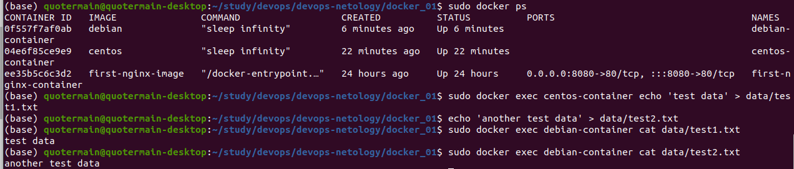

1. https://hub.docker.com/repository/docker/quotermain/nginx_simple

2. * Для высоконагруженного монолитного приложения, думаю, лучше выделить отдельную физическую машину, т.к. при использовании виртуальной машины или контейнеров может возникнуть ситуация "гонки" за ресурсами хоста.
  * Для Nodejs приложения подойдет контейнерная архитектура, потому что каждый участок бизнес-логики можно упаковать отдельно.
  * Для мобильного приложения под Android и iOS, думаю, лучше выделить отдельные виртуальные машины, т.к. для этих ОС будут отличаться не только пользовательские интерфейсы, но и весь процесс разработки, поэтому функционала контейнеров будет недостаточно.
  * Т. к. в случае с шиной данных на базе Apache Kafka одно из решающих значений имеет отказоустойчивость, предлагается реализовать предложенную в задаче схему на физических серверах.
  * Из описания Elasticsearch-стека я понял, что данная технология формирует некое подобие собственной базы данных (индекс), поэтому единая точка отказа в данном случае противопоказана, ввиду чего предлагается реализация на физических серверах.
  * Для мониторинг-стека подойдёт реализация, основанная на контейнерах, т.к. надёжного хранилища данных указанные технологии по умолчанию не требуют, как не требуют для своей работы отдельной гостевой ОС на виртуальной машине.
  * Для основного хранилища данных приложения лучше использовать реализацию на физическом сервере во избежание единой точки отказа.
  * В последнем сценарии также предлагается реализация на физическом сервере, т.к. предполагается хранение большого набора данных, для чего важным критерием является отказоустойчивость.   
  

3. 
