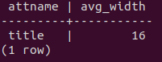
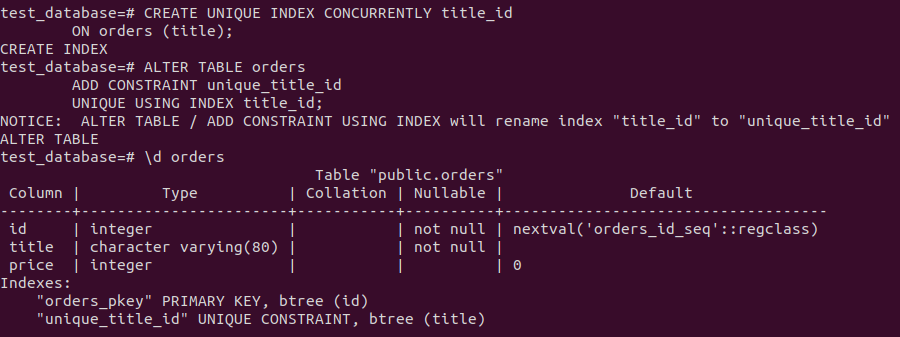

1. Команды:   
* вывод списка БД: ```\l```;
* подключение к БД: ```\c 'database'```;
* вывод списка таблиц: ```\dt``` при кодключении к базе данных;
* вывода описания содержимого таблиц: ```/d 'table'```;
* выход из psql: ```\q```.   

2. Использовал следующую команду:   
```sql
SELECT attname, avg_width FROM pg_stats WHERE tablename='orders' AND avg_width=(SELECT MAX(avg_width) FROM pg_stats WHERE tablename='orders');
```
Результат:   


3. Поставленную задачу решил командой:   
```psql -U postgres -d test_database < divide_table.sql```   
Содержание файла divide_table.sql:   
```sql
BEGIN;
	CREATE table orders_1 AS SELECT * FROM orders
	WHERE price>499;
	CREATE table orders_2 AS SELECT * FROM orders
	WHERE price<=499;
COMMIT;
```   
При проектировании я бы решил эту задачу через control flow какого-нибудь языка программирования через какую-нибудь библиотеку. То есть обработку значения и принятие решения о помещении этого значения в ту или иную таблицу я бы поручил процессу, например, python, который с помощью if/else применил бы INSERT в подходящую таблицу.

4. Бэкап находится [тут](backups/test_database_backup.sql). Для добавления уникальности к столбцам уже существующих таблиц необходимо создать уникальный индекс:   

