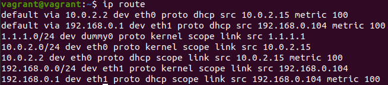
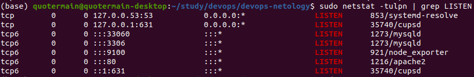
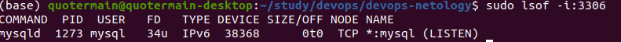
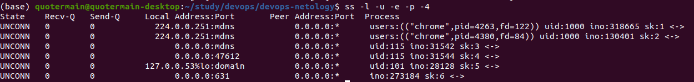
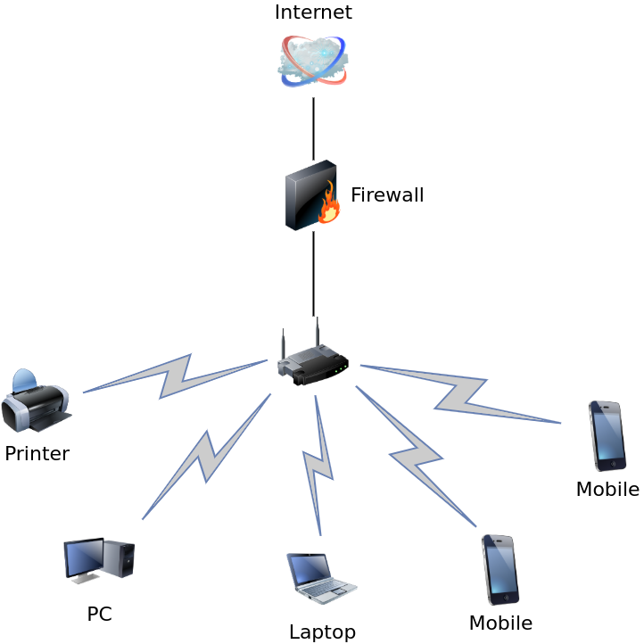

1. Выполнил по иструкции. Вижу следующее:


2. Добавил интерфейс с ip 1.1.1.0/24:


3. Для просмотра открытых TCP портов можно использовать, например, команду ```sudo netstat -tulpn | grep LISTEN```:

Например, порт 3306 использует протокол IPv6 и приложение mysqld:
.

4. Проверить используемые UDP сокеты можно командой ```ss -l -u -e -p -4```:

Данная команда выводит UDP сокеты, использующие только протокол IPv4. Среди используемых приложений присутствует браузер chrome.

5. Примерно так:

