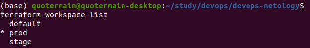

Сделал то, чему нашёл аналогию на Yandex Cloud.   
Вывод команды terraform ```workspace list```:    
   

Вывод команды ```terraform plan``` для воркспейса ```prod```:   
```console
(base) quotermain@quotermain-desktop:~/study/devops/devops-netology$ terraform plan

Terraform used the selected providers to generate the following
execution plan. Resource actions are indicated with the following
symbols:
  + create

Terraform will perform the following actions:

  # yandex_compute_instance.default["vm1"] will be created
  + resource "yandex_compute_instance" "default" {
      + created_at                = (known after apply)
      + folder_id                 = (known after apply)
      + fqdn                      = (known after apply)
      + hostname                  = (known after apply)
      + id                        = (known after apply)
      + metadata                  = {
          + "foo"      = "bar"
          + "ssh-keys" = <<-EOT
                ubuntu:ssh-rsa AAAAB3NzaC1yc2EAAAADAQABAAABgQCvY7rMDMUnvFmofxXGdlMDUYXmmMXGwnQFN/aByNo0an82rEZunCP8O0g+zVH/sw1nTf9GNhOFJyDzXeC86g0STcyeqyY6yDvnDQGqKRYCX3sCrwNissS0P//+ExqnIZK7NDMm9Fq7Xq5vOhNXlJru8UZr6JHuXlY02F3z95a17YeNHRzzveFp+hzvG55ZomoDfevYbP5STSgK+cF4ogCb7tGtyAU0N17aGbrO3uHdBEXwrxoSUi8zQl9Stz7qTwHaFB2gfxc5fQpBIhNZ32OakQBY7qFfnPYnD8l/Qlym+hXpiQnXpPJDd+dMTOpYpKMqevuRUVLj/XFGXHww4G9hlYiYlkLFPYw5cvTzOgu29FFIhy2Y5D2BMjtM+J86APEcrxxdRdV+5grfpS+i7y/7dXKGSC0dFEpFplOMKsbRplcbRpXyIgu62mtS+ED29UXG+18YRly0W0Y02oLjILKIljH/su5q+jE6G44HvWke7Gcbh4ZTeNPH/WkL0Ng8ttc= quotermain@quotermain-desktop
            EOT
        }
      + name                      = "test1"
      + network_acceleration_type = "standard"
      + platform_id               = "standard-v1"
      + service_account_id        = (known after apply)
      + status                    = (known after apply)
      + zone                      = "ru-central1-a"

      + boot_disk {
          + auto_delete = true
          + device_name = (known after apply)
          + disk_id     = (known after apply)
          + mode        = (known after apply)

          + initialize_params {
              + block_size  = (known after apply)
              + description = (known after apply)
              + image_id    = "fd8hafusaj96qep5ub6h"
              + name        = (known after apply)
              + size        = (known after apply)
              + snapshot_id = (known after apply)
              + type        = "network-hdd"
            }
        }

      + network_interface {
          + index              = (known after apply)
          + ip_address         = (known after apply)
          + ipv4               = true
          + ipv6               = (known after apply)
          + ipv6_address       = (known after apply)
          + mac_address        = (known after apply)
          + nat                = true
          + nat_ip_address     = (known after apply)
          + nat_ip_version     = (known after apply)
          + security_group_ids = (known after apply)
          + subnet_id          = (known after apply)
        }

      + placement_policy {
          + host_affinity_rules = (known after apply)
          + placement_group_id  = (known after apply)
        }

      + resources {
          + core_fraction = 100
          + cores         = 2
          + memory        = 4
        }

      + scheduling_policy {
          + preemptible = (known after apply)
        }
    }

  # yandex_compute_instance.default["vm2"] will be created
  + resource "yandex_compute_instance" "default" {
      + created_at                = (known after apply)
      + folder_id                 = (known after apply)
      + fqdn                      = (known after apply)
      + hostname                  = (known after apply)
      + id                        = (known after apply)
      + metadata                  = {
          + "foo"      = "bar"
          + "ssh-keys" = <<-EOT
                ubuntu:ssh-rsa AAAAB3NzaC1yc2EAAAADAQABAAABgQCvY7rMDMUnvFmofxXGdlMDUYXmmMXGwnQFN/aByNo0an82rEZunCP8O0g+zVH/sw1nTf9GNhOFJyDzXeC86g0STcyeqyY6yDvnDQGqKRYCX3sCrwNissS0P//+ExqnIZK7NDMm9Fq7Xq5vOhNXlJru8UZr6JHuXlY02F3z95a17YeNHRzzveFp+hzvG55ZomoDfevYbP5STSgK+cF4ogCb7tGtyAU0N17aGbrO3uHdBEXwrxoSUi8zQl9Stz7qTwHaFB2gfxc5fQpBIhNZ32OakQBY7qFfnPYnD8l/Qlym+hXpiQnXpPJDd+dMTOpYpKMqevuRUVLj/XFGXHww4G9hlYiYlkLFPYw5cvTzOgu29FFIhy2Y5D2BMjtM+J86APEcrxxdRdV+5grfpS+i7y/7dXKGSC0dFEpFplOMKsbRplcbRpXyIgu62mtS+ED29UXG+18YRly0W0Y02oLjILKIljH/su5q+jE6G44HvWke7Gcbh4ZTeNPH/WkL0Ng8ttc= quotermain@quotermain-desktop
            EOT
        }
      + name                      = "test2"
      + network_acceleration_type = "standard"
      + platform_id               = "standard-v1"
      + service_account_id        = (known after apply)
      + status                    = (known after apply)
      + zone                      = "ru-central1-a"

      + boot_disk {
          + auto_delete = true
          + device_name = (known after apply)
          + disk_id     = (known after apply)
          + mode        = (known after apply)

          + initialize_params {
              + block_size  = (known after apply)
              + description = (known after apply)
              + image_id    = "fd8hafusaj96qep5ub6h"
              + name        = (known after apply)
              + size        = (known after apply)
              + snapshot_id = (known after apply)
              + type        = "network-hdd"
            }
        }

      + network_interface {
          + index              = (known after apply)
          + ip_address         = (known after apply)
          + ipv4               = true
          + ipv6               = (known after apply)
          + ipv6_address       = (known after apply)
          + mac_address        = (known after apply)
          + nat                = true
          + nat_ip_address     = (known after apply)
          + nat_ip_version     = (known after apply)
          + security_group_ids = (known after apply)
          + subnet_id          = (known after apply)
        }

      + placement_policy {
          + host_affinity_rules = (known after apply)
          + placement_group_id  = (known after apply)
        }

      + resources {
          + core_fraction = 100
          + cores         = 2
          + memory        = 4
        }

      + scheduling_policy {
          + preemptible = (known after apply)
        }
    }

  # yandex_compute_instance.default["vm3"] will be created
  + resource "yandex_compute_instance" "default" {
      + created_at                = (known after apply)
      + folder_id                 = (known after apply)
      + fqdn                      = (known after apply)
      + hostname                  = (known after apply)
      + id                        = (known after apply)
      + metadata                  = {
          + "foo"      = "bar"
          + "ssh-keys" = <<-EOT
                ubuntu:ssh-rsa AAAAB3NzaC1yc2EAAAADAQABAAABgQCvY7rMDMUnvFmofxXGdlMDUYXmmMXGwnQFN/aByNo0an82rEZunCP8O0g+zVH/sw1nTf9GNhOFJyDzXeC86g0STcyeqyY6yDvnDQGqKRYCX3sCrwNissS0P//+ExqnIZK7NDMm9Fq7Xq5vOhNXlJru8UZr6JHuXlY02F3z95a17YeNHRzzveFp+hzvG55ZomoDfevYbP5STSgK+cF4ogCb7tGtyAU0N17aGbrO3uHdBEXwrxoSUi8zQl9Stz7qTwHaFB2gfxc5fQpBIhNZ32OakQBY7qFfnPYnD8l/Qlym+hXpiQnXpPJDd+dMTOpYpKMqevuRUVLj/XFGXHww4G9hlYiYlkLFPYw5cvTzOgu29FFIhy2Y5D2BMjtM+J86APEcrxxdRdV+5grfpS+i7y/7dXKGSC0dFEpFplOMKsbRplcbRpXyIgu62mtS+ED29UXG+18YRly0W0Y02oLjILKIljH/su5q+jE6G44HvWke7Gcbh4ZTeNPH/WkL0Ng8ttc= quotermain@quotermain-desktop
            EOT
        }
      + name                      = "test3"
      + network_acceleration_type = "standard"
      + platform_id               = "standard-v1"
      + service_account_id        = (known after apply)
      + status                    = (known after apply)
      + zone                      = "ru-central1-a"

      + boot_disk {
          + auto_delete = true
          + device_name = (known after apply)
          + disk_id     = (known after apply)
          + mode        = (known after apply)

          + initialize_params {
              + block_size  = (known after apply)
              + description = (known after apply)
              + image_id    = "fd8hafusaj96qep5ub6h"
              + name        = (known after apply)
              + size        = (known after apply)
              + snapshot_id = (known after apply)
              + type        = "network-hdd"
            }
        }

      + network_interface {
          + index              = (known after apply)
          + ip_address         = (known after apply)
          + ipv4               = true
          + ipv6               = (known after apply)
          + ipv6_address       = (known after apply)
          + mac_address        = (known after apply)
          + nat                = true
          + nat_ip_address     = (known after apply)
          + nat_ip_version     = (known after apply)
          + security_group_ids = (known after apply)
          + subnet_id          = (known after apply)
        }

      + placement_policy {
          + host_affinity_rules = (known after apply)
          + placement_group_id  = (known after apply)
        }

      + resources {
          + core_fraction = 100
          + cores         = 2
          + memory        = 4
        }

      + scheduling_policy {
          + preemptible = (known after apply)
        }
    }

  # yandex_vpc_network.foo will be created
  + resource "yandex_vpc_network" "foo" {
      + created_at                = (known after apply)
      + default_security_group_id = (known after apply)
      + folder_id                 = (known after apply)
      + id                        = (known after apply)
      + labels                    = (known after apply)
      + name                      = (known after apply)
      + subnet_ids                = (known after apply)
    }

  # yandex_vpc_subnet.foo will be created
  + resource "yandex_vpc_subnet" "foo" {
      + created_at     = (known after apply)
      + folder_id      = (known after apply)
      + id             = (known after apply)
      + labels         = (known after apply)
      + name           = (known after apply)
      + network_id     = (known after apply)
      + v4_cidr_blocks = [
          + "10.2.0.0/16",
        ]
      + v6_cidr_blocks = (known after apply)
      + zone           = "ru-central1-a"
    }

Plan: 5 to add, 0 to change, 0 to destroy.

────────────────────────────────────────────────────────────────────

Note: You didn't use the -out option to save this plan, so Terraform
can't guarantee to take exactly these actions if you run "terraform
apply" now.

```
