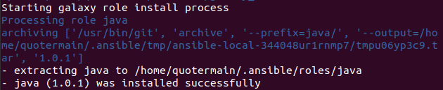
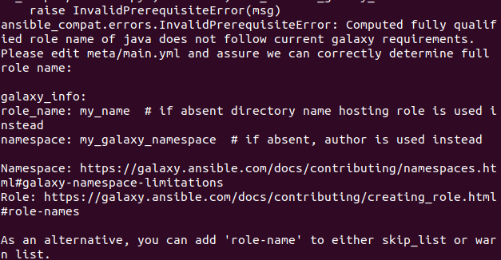
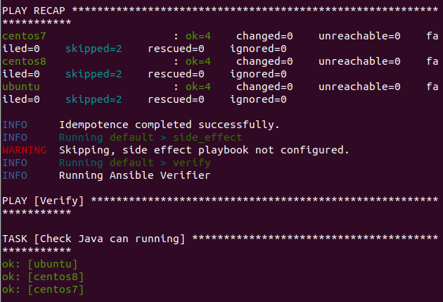
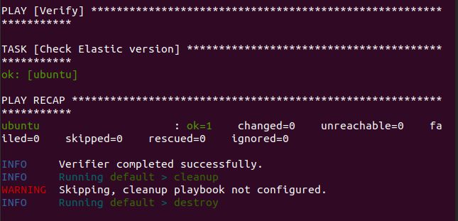
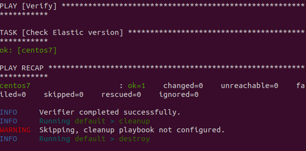
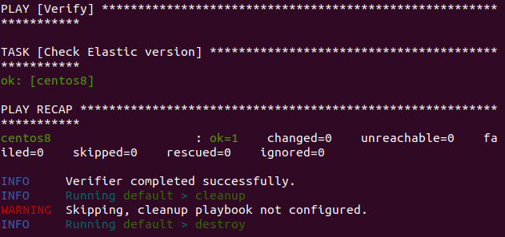
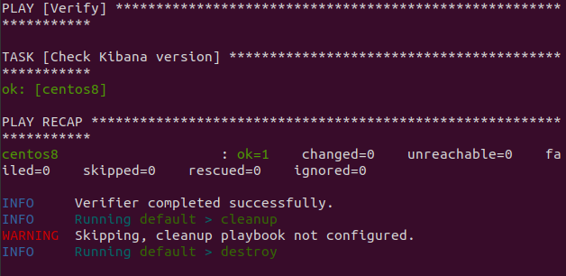
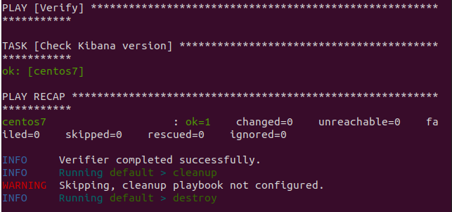
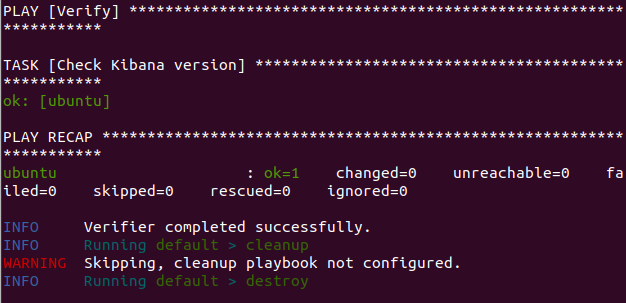

Java роль скачана успешно:   
   
Однако при попытке запуска ```molecule test``` получал примерно следующее:   
   
Добавил в файл meta/main.yml с ролью java строку с произвольным namespace и role_name: java. Вижу следующее:   
   
Переработал role для elasticsearch, чтобы файл загружался на целевой узел с контролирующего узла (по предложенной в задании ссылке получаю 403).   
Результаты прогона:   




   

С Кибаной тоже всё получилось:   


   


